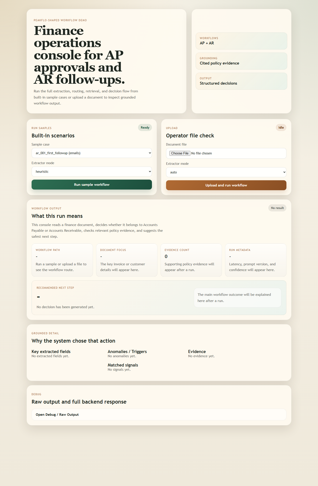
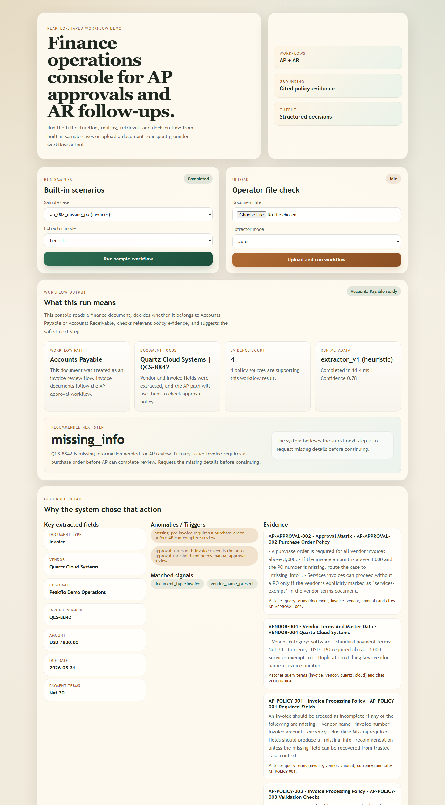

# Peakflo Finance Agent Demo

A finance workflow AI demo built to match the shape of the Peakflo ML Engineer
Intern role: document ingestion, structured extraction, retrieval-grounded
reasoning, workflow routing, and business-action output for AP and AR cases.

## What It Does

The project supports two narrow workflows:

### Accounts Payable
- ingest an invoice document
- extract structured fields
- retrieve approval and vendor policy context
- return one of:
  - `approve`
  - `review`
  - `reject`
  - `missing_info`

### Accounts Receivable
- ingest an overdue invoice case or customer finance email
- retrieve reminder and escalation guidance
- draft a grounded follow-up email
- return an escalation level plus evidence

## Why This Project Exists

This repo is intentionally shaped around the kind of problems Peakflo is hiring
for:

- OCR-assisted document ingestion
- structured extraction
- retrieval-grounded workflow reasoning
- policy-aware automation
- Python backend systems
- evaluation and reliability thinking

## Quick Look

### Console Overview



### AP Result Walkthrough



## Current Status

Implemented:
- sample and upload ingestion
- PDF parsing with OCR fallback hooks
- strict extraction schema
- deterministic development extractor
- retrieval-ready finance knowledge base
- policy retrieval with citations
- AP vs AR routing
- AP decision flow
- AR drafting flow
- TTS-safe AR follow-up variants for dates, amounts, and identifiers
- workflow audit trail with prompt version, stage timings, retrieved chunks, and final action
- shared anomaly and escalation assessment
- FastAPI backend
- operator UI at `/ui`
- evaluation dataset and runner
- clean smoke-test run in a separate virtual environment

Still worth improving:
- citation coverage against the strict eval targets
- AR subject/draft phrasing coverage
- production-grade OCR/runtime setup
- live deployment and final demo recording

## Architecture

```text
[Document Input: PDF / text / email fixture]
                  |
                  v
         [Ingestion Layer]
                  |
                  v
         [Extractor Agent]
                  |
                  v
         [Workflow Router]
                  |
          +-------+-------+
          |               |
          v               v
 [Grounded Policy Context] [Grounded Policy Context]
          |               |
          v               v
   [AP Decision Flow]   [AR Drafting Flow]
          |               |
          +-------+-------+
                  |
                  v
      [Structured Result + Evidence]
```

## Workflow Design

### AP Flow

Input:
- invoice PDF or text fixture
- vendor-specific policy context

Checks:
- missing required invoice fields
- purchase order requirement
- duplicate invoice hints
- payment terms mismatch
- approval threshold
- invalid/void invoice wording
- line-item total mismatch

Output:
- recommendation
- anomaly list
- reviewer summary
- cited evidence

### AR Flow

Input:
- overdue invoice case or customer reply
- customer tone and escalation context

Checks:
- overdue-day band
- prior reminder count
- payment-claimed-without-proof case
- missing due date / invoice number
- escalation trigger set

Output:
- escalation level
- subject line
- follow-up email draft
- TTS-safe subject and follow-up draft
- cited evidence

## Repository Layout

```text
peakflo-finance-agent-demo/
|- api/
|  `- main.py
|- docs/
|  `- showcase.md
|- app/
|  |- agents/
|  |- eval/
|  |- ingest/
|  |- orchestrator/
|  |- prompts/
|  |- rag/
|  `- schemas/
|- kb/
|- samples/
|  |- emails/
|  |- expected_outputs/
|  `- invoices/
`- web/
```

## Showcase Assets

- `docs/showcase.md` contains the demo script, recorder checklist, resume bullets, and application blurb for this project.

## Quick Start

From the project root:

```bash
python -m venv .venv
.venv\Scripts\activate
pip install -r requirements.txt
uvicorn api.main:app --reload
```

Then open:

- API root: `http://127.0.0.1:8000/`
- Operator UI: `http://127.0.0.1:8000/ui`

## UI And API

### UI

Use `/ui` to:
- run built-in sample workflows
- upload a local file
- inspect the workflow path, key document fields, final action, anomalies/triggers, and evidence
- inspect latency and prompt-version metadata in the summary line
- open the full backend response only when needed through the collapsible debug panel

For screenshots or quick demos, the UI also supports:

- `/ui?sample=ap_002_missing_po&mode=heuristic&autorun=1`
- `/ui?sample=ar_003_payment_claim_no_proof&mode=heuristic&autorun=1`

### API Routes

- `GET /`
- `GET /ui`
- `GET /health`
- `GET /samples`
- `POST /workflow/sample`
- `POST /workflow/upload`

Workflow responses now include:
- `audit_trail.requested_extractor_mode`
- `audit_trail.effective_extractor_mode`
- `audit_trail.prompt_version`
- `audit_trail.stage_latencies_ms`
- `audit_trail.total_latency_ms`
- `audit_trail.final_recommendation`
- `audit_trail.evidence_sources`
- `audit_trail.retrieved_chunks`

### Sample Run

Good sample cases to show:

- `ap_002_missing_po`
- `ap_004_duplicate_invoice`
- `ar_001_first_followup`
- `ar_003_payment_claim_no_proof`

## Evaluation

Run the built-in evaluation suite from the repo root:

```bash
python -m app.eval.run_eval
```

The eval runner checks:
- workflow-type match
- extraction field match rate
- AP/AR final decision match
- citation coverage
- anomaly coverage
- AR subject coverage
- AR draft mention coverage
- case latency

Prompt A/B comparison:

```bash
python -m app.eval.prompt_ab
```

That script:
- compares `extractor_v1` vs `extractor_v2`
- always runs a structural prompt audit
- runs dataset-level runtime comparison too when `OPENAI_API_KEY` is configured

The current heuristic baseline already shows:
- workflow routing is correct
- anomaly checks are strong
- extraction is mostly correct
- citation coverage still needs improvement
- some AR phrasing still misses strict expected text fragments

## Demo Path

Best short walkthrough:

1. Start the API with `uvicorn api.main:app --reload`
2. Open `/ui`
3. Run `ap_002_missing_po`
4. Show:
   - structured extraction
   - route to AP
   - policy evidence
   - `missing_info` recommendation
5. Run `ar_003_payment_claim_no_proof`
6. Show:
   - route to AR
   - escalation level
   - grounded follow-up draft
7. Run `python -m app.eval.run_eval`
8. Point out the current weak spots and what you would improve next

## Known Limitations

- The local environment still needs dependencies installed to run the full stack
  normally.
- OCR fallback depends on Tesseract being installed on the host machine.
- The `heuristic` extractor path is intentionally tuned for the sample fixtures.
- The `llm` extractor/repair path requires an OpenAI-compatible API key and
  runtime configuration.
- Citation selection is not yet strong enough to satisfy every strict eval
  target.
- TTS-safe output is currently implemented for AR follow-up text only.
- The UI is intentionally minimal and optimized for inspection, not production
  polish.

## Next Improvements

- improve evidence selection so expected policy IDs are covered more reliably
- tighten AR subject/body phrasing against eval expectations
- run prompt A/B comparison with a configured LLM path and keep the stronger extractor prompt
- add deployment instructions and live hosting
- record a short demo video
- add a final pass on README screenshots and operator flow
