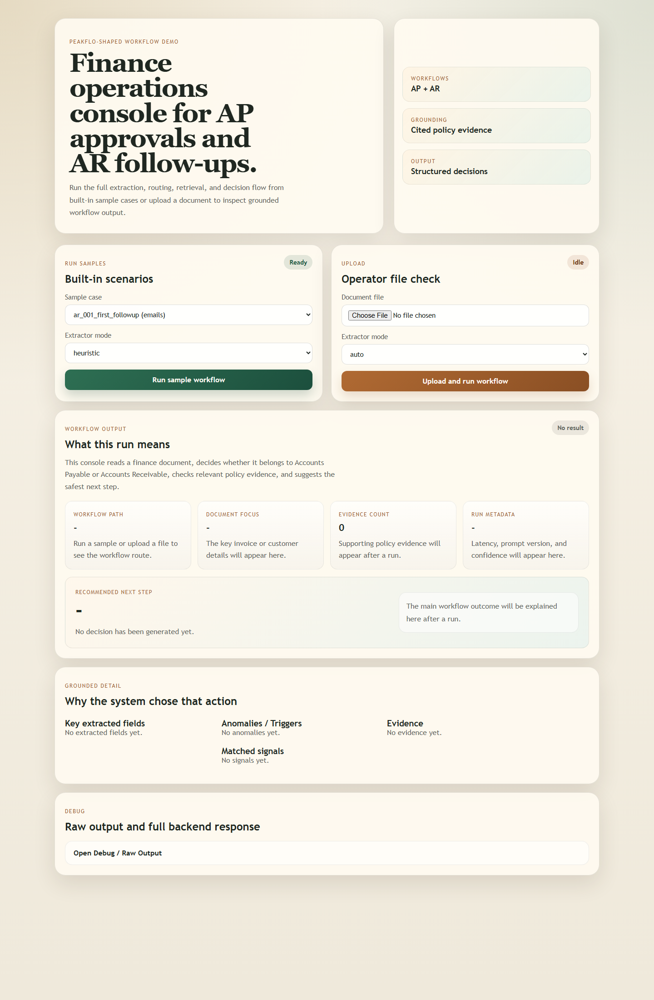
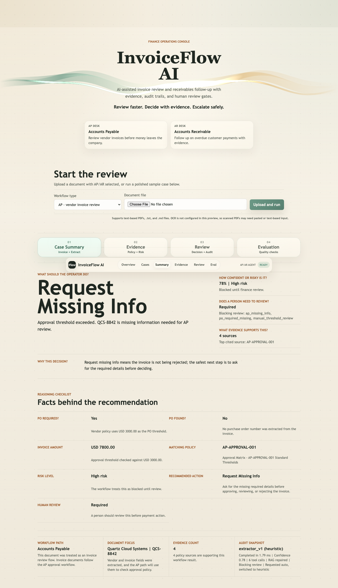

# InvoiceFlow AI

AI-assisted finance workflow for policy-grounded invoice review, human review,
and deterministic evaluations.

[](https://github.com/GargiGupta-io/invoiceflow-ai/actions/workflows/eval.yml)
[](https://render.com/deploy?repo=https://github.com/GargiGupta-io/invoiceflow-ai)

Live demo: [https://invoiceflow-ai-a9yq.onrender.com/ui](https://invoiceflow-ai-a9yq.onrender.com/ui)  
Health check: [https://invoiceflow-ai-a9yq.onrender.com/health](https://invoiceflow-ai-a9yq.onrender.com/health)

Finance Reviewer Demo Pack: [docs/demo-pack.md](docs/demo-pack.md)

InvoiceFlow AI helps operations teams review AP invoices, detect missing or
risky information, retrieve policy evidence, draft AR follow-ups, and route
uncertain cases to human review with a full audit trail.

I originally built InvoiceFlow AI as a YC-style product prototype for finance
workflow automation, then expanded it into a general AI operations project
focused on invoice review, AR follow-ups, policy evidence, and audit trails.

The product promise is simple:

```text
Select or upload an invoice/AR case
  -> extract key facts
  -> check policy evidence
  -> detect risk
  -> recommend an action
  -> route uncertain cases to human review
  -> preserve an audit trail
```

Review faster. Decide with evidence. Escalate safely.

## The Problem

Finance teams spend time manually checking invoices, matching policy rules,
identifying missing purchase orders, reviewing payment terms, and writing
follow-up emails for overdue invoices.

Generic AI chat tools are not enough because finance workflows need structure,
evidence, repeatability, and human approval. A finance operator needs to know
what action to take, why that action is supported, and when a person should
review the case before anything moves forward.

## What InvoiceFlow Does

InvoiceFlow turns invoice and receivables work into a reviewable workflow:

```text
Input
  -> extracted facts
  -> AP/AR route
  -> policy evidence
  -> risk checks
  -> recommendation or draft
  -> human review gate
  -> audit trail
```

| Input | Output |
| --- | --- |
| Invoice PDF | Extracted vendor, invoice number, amount, due date, PO status, payment terms, and line items. |
| Invoice text | AP workflow route, missing-field checks, anomaly list, policy evidence, and recommendation. |
| Overdue invoice case | AR route, escalation level, safe follow-up subject, and follow-up draft. |
| Customer finance email | Payment-claim checks, missing-proof flags, reminder guidance, and review status. |
| Finance policy documents | Retrieved policy evidence with source names, citation IDs, and decision influence. |
| Workflow result | Confidence/risk summary, human review decision, tool trace, audit metadata, and raw JSON for debugging. |

## Best Demo Path

Use this path when showing the project to a recruiter, client, or technical
reviewer:

1. Open the operator console at `/ui`.
2. Select the `Missing PO Invoice` sample.
3. Review the extracted invoice fields.
4. Check the final recommendation.
5. Open the policy evidence panel.
6. Review the anomaly list and "Why this decision?" explanation.
7. Send the case to human review.
8. Open the compact audit trail.
9. Run the `AR Overdue Follow-Up` sample.
10. Show the drafted follow-up email and escalation reasoning.

For a finance-operator proof artifact, use the
[Finance Reviewer Demo Pack](docs/demo-pack.md). It walks through the Missing
PO case from input invoice to expected decision, extracted fields, policy
evidence, human-review reason, audit trail, and operator next step.

## Safety And Privacy

InvoiceFlow is designed as an evidence-backed assistant, not an unchecked
autopilot.

- No raw API keys are committed.
- Demo mode uses bundled sample data by default.
- Uploaded files are processed for the current workflow run.
- Recommendations are shown with policy evidence and audit metadata.
- Low-confidence, risky, or weakly grounded cases route to human review.
- Raw model/debug outputs stay behind advanced inspection views.
- The audit trail records decision metadata, tool trace steps, retrieved
  evidence, review-gate status, latency, and prompt metadata when available.

## Demo Mode And Live AI Mode

The project is built so the main demo does not break without paid API keys.

| Mode | What it does | When to use |
| --- | --- | --- |
| Demo mode | Uses deterministic sample fixtures, local policy retrieval, AP/AR logic, evidence, review gates, and evals. | Portfolio demos, recruiter walkthroughs, local testing, and deployment without secrets. |
| Live AI mode | Uses the configured LLM path for schema-shaped extraction and repair metadata when credentials are available. | Technical review of optional LLM extraction, request-gateway behavior, prompt versions, and runtime metadata. |

## How This Can Be Adapted For A Client

InvoiceFlow can be customized for:

- company-specific invoice approval policies
- vendor-specific purchase-order rules
- duplicate invoice detection logic
- ERP or accounting export formats
- AR reminder and escalation templates
- approval workflows and reviewer queues
- Slack, Teams, or email notifications
- CSV exports and finance reporting
- department-specific audit requirements

## What This Project Demonstrates

- AI workflow orchestration
- document ingestion and structured extraction
- grounded policy retrieval with citeable evidence
- schema validation and repair-aware extraction
- AP invoice review logic
- AR follow-up drafting logic
- human-in-the-loop review design
- audit-friendly AI outputs
- FastAPI backend development
- frontend operator-console design
- evaluation-driven AI development
- CI/CD quality gating for AI workflows
- production-aware failure handling

## Technical Review

The sections below are for reviewers who want implementation details after the
product story is clear.

## Product Snapshot

```text
Input invoice or AR case
  -> structured extraction
  -> AP/AR routing
  -> policy evidence retrieval
  -> validation and anomaly checks
  -> recommendation or follow-up draft
  -> human review gate
  -> audit trail and eval metrics
```

## Core Workflows

The product supports two focused finance workflows:

### Accounts Payable
- ingest an invoice document
- extract structured fields
- retrieve approval and vendor policy context
- return one of:
  - `approve`
  - `review`
  - `reject`
  - `missing_info`

### Accounts Receivable
- ingest an overdue invoice case or customer finance email
- retrieve reminder and escalation guidance
- draft a grounded follow-up email
- return an escalation level plus evidence

## Why This Project Exists

This repo is intentionally shaped around workflow-heavy finance operations, not
generic chat. The main story is:

- AP invoices should be reviewed against policy before payment.
- AR follow-ups should be drafted from case data without aggressive or unsupported escalation.
- Risky, missing, or weakly grounded cases should route to human review.
- Recommendations should be backed by citations, audit metadata, and eval results.

## Quick Look

### Console Overview



### AP Result Walkthrough



## Implementation Snapshot

Implemented:
- sample and upload ingestion
- page-aware PDF parsing and open-source OCR for scanned pages, PNG, and JPEG uploads
- strict extraction schema
- deterministic development extractor
- optional LLM extraction path with schema-shaped JSON responses and validation repair
- optional LLM request gateway for schema-mode fallback, PII-aware request redaction, latency metadata, and token metadata when available
- deterministic lexical index over the finance knowledge base
- lexical policy retrieval with citations
- explicit tool-like workflow trace for extraction, routing, policy search, validation, and action generation
- AP vs AR routing
- AP decision flow
- AR drafting flow
- confidence-based human review gate for risky, low-evidence, or missing-information cases
- TTS-safe AR follow-up variants for dates, amounts, and identifiers
- workflow audit trail with prompt version, stage timings, retrieved chunks, and final action
- redacted JSON worker events with request/job correlation and CloudWatch metric fields
- separate liveness and PostgreSQL/S3/SQS readiness endpoints for Version 2 deployment checks
- configurable document expiry, tenant-authorized deletion, and idempotent retention cleanup
- tenant-isolated page text storage with PostgreSQL full-text search and page locations
- one non-root Python 3.11 container image for API, worker, and migration tasks
- validated Terraform for private S3, SQS/DLQ, RDS PostgreSQL, Cognito, IAM, ECS/Fargate, and CloudWatch
- React reviewer workspace with Cognito authorization-code/PKCE login, session-only token storage, tenant identity verification, secure document upload, persistent history, live processing states, decision-first case detail, extracted pages, policy evidence, review actions, and audit history
- shared anomaly and escalation assessment
- FastAPI backend
- operator UI at `/ui`
- polished operator-console layout with brand bar, grid-backed hero, reliability callouts, and decision/evidence panels
- evaluation dataset and runner
- CI/CD eval threshold gate for reliability regressions
- clean smoke-test run in a separate virtual environment

Still worth improving:
- production-grade OCR/runtime setup
- final demo walkthrough recording
- LLM-based AP/AR decision drafting behind the existing schemas
- cost and token tracking for LLM mode

## Technical Architecture

The current finance workflow and the Version 2 production-shaped AWS design are
documented separately:

- [Version 2 architecture](docs/architecture.md)
- [Version 2 security model](docs/security.md)
- [Version 2 reliability model](docs/reliability.md)
- [Terraform deployment guide](infra/terraform/README.md)

The Terraform configuration is validated infrastructure code on the feature
branch. It has not been applied to an AWS account, so the hosted Render URL
remains the deterministic Version 1 portfolio demo.

```text
[Document Input: PDF / text / email fixture]
                  |
                  v
         [Ingestion Layer]
                  |
                  v
         [Extractor Agent]
                  |
                  v
         [Workflow Router]
                  |
          +-------+-------+
          |               |
          v               v
 [Grounded Policy Context] [Grounded Policy Context]
          |               |
          v               v
   [AP Decision Flow]   [AR Drafting Flow]
          |               |
          +-------+-------+
                  |
                  v
 [Tool Trace + Human Review Gate]
                  |
                  v
      [Structured Result + Evidence]
```

## Workflow Logic

### AP Flow

Input:
- invoice PDF or text fixture
- vendor-specific policy context

Checks:
- missing required invoice fields
- purchase order requirement
- duplicate invoice hints
- payment terms mismatch
- approval threshold
- invalid/void invoice wording
- line-item total mismatch

Output:
- recommendation
- anomaly list
- reviewer summary
- cited evidence

### AR Flow

Input:
- overdue invoice case or customer reply
- customer tone and escalation context

Checks:
- overdue-day band
- prior reminder count
- payment-claimed-without-proof case
- missing due date / invoice number
- escalation trigger set

Output:
- escalation level
- subject line
- follow-up email draft
- TTS-safe subject and follow-up draft
- cited evidence

## Repository Layout

```text
invoiceflow-ai/
|- api/
|  `- main.py
|- docs/
|  |- architecture.md
|  |- security.md
|  |- reliability.md
|  `- showcase.md
|- infra/
|  `- terraform/
|- app/
|  |- agents/
|  |- eval/
|  |- ingest/
|  |- orchestrator/
|  |- prompts/
|  |- rag/             # internal package name for lexical policy retrieval
|  `- schemas/
|- kb/
|- samples/
|  |- emails/
|  |- expected_outputs/
|  `- invoices/
`- web/
```

## Showcase Assets

- `docs/showcase.md` contains the demo script, recorder checklist, resume bullets, and application blurb for this project.

## Quick Start

From the project root:

```bash
python3.11 -m venv .venv
source .venv/bin/activate
python -m pip install -r requirements.txt
uvicorn api.main:app --reload
```

Then open:

- API root: `http://127.0.0.1:8000/`
- Operator UI: `http://127.0.0.1:8000/ui`

The Version 2 reviewer shell is built separately and served by FastAPI:

```bash
cd reviewer
npm install
npm run build
cd ..
uvicorn api.main:app --reload
```

Then open `http://127.0.0.1:8000/reviewer`. An authenticated reviewer can upload
PDF, PNG, or JPEG documents, dispatch processing, and follow saved cases through
queued, processing, completed, or failed states. Completed cases expose the
recommendation, structured facts, policy evidence, extracted source pages,
short-lived private document access, human review controls, and append-only
audit history. Browser login requires the
`AUTH_ISSUER`, `AUTH_CLIENT_ID`, `AUTH_BROWSER_DOMAIN`, `AUTH_REDIRECT_URI`,
and `AUTH_LOGOUT_URI` settings. Without them, the reviewer shell returns a safe
unavailable state and the public `/ui` demo remains usable.

## Deployment

InvoiceFlow is prepared for a hosted demo with deterministic sample data. The
basic portfolio demo does not require a paid LLM or OCR key.

Render setup:

- Runtime: Python 3.11
- Build command: `pip install -r requirements.txt`
- Start command: `uvicorn api.main:app --host 0.0.0.0 --port $PORT`
- Health check: `/health`
- Demo endpoint: `/ui`

The repo includes:

- `runtime.txt` for Python 3.11 pinning
- `render.yaml` for Render blueprint deployment
- `Dockerfile` for the API, worker, and migration commands
- `reviewer/` for the React/Cognito reviewer shell bundled into the production image
- `infra/terraform/` for production and cost-limited Free Plan AWS profiles

Deploy from GitHub:

1. Open the Render deploy link at the top of this README.
2. Connect the public repo: `GargiGupta-io/invoiceflow-ai`.
3. Keep the blueprint defaults from `render.yaml`.
4. After the deploy finishes, open `/health` and `/ui`.

Hosted demo: [https://invoiceflow-ai-a9yq.onrender.com/ui](https://invoiceflow-ai-a9yq.onrender.com/ui)
Health check: [https://invoiceflow-ai-a9yq.onrender.com/health](https://invoiceflow-ai-a9yq.onrender.com/health)
Note: Render free-tier deployments may take up to a minute to wake on first
load.

Version 2 AWS deployment is intentionally separate from the public demo. Its
Terraform stack defines private Fargate tasks, private RDS PostgreSQL, private
S3, SQS/DLQ, Cognito, scoped IAM roles, HTTPS ingress, and CloudWatch alarms.
Follow [the infrastructure guide](infra/terraform/README.md) to review costs,
bootstrap remote state, build an immutable image, plan the stack, and run the
database migration and reviewer-provisioning tasks. The first release keeps API
and worker services at zero until the image exists and the migration succeeds.
No paid AWS resources are created by this repository automatically.

## Technical UI And API Reference

### UI

Use `/ui` to:
- start from the operator entry screen with `Run AP Sample`, `Run AR Sample`, `Upload Invoice`, and `View Evaluation`
- inspect the first-screen snapshot for workflow state, AP/AR sample count, upload readiness, latest audit summary, and eval pass rate
- run built-in sample workflows from the hero buttons, quick sample chips, or sample selector
- upload a local invoice or finance document
- inspect the workflow path, key document fields, final action, anomalies/triggers, and evidence
- inspect latency, prompt-version metadata, policy-retrieval repair status, and optional LLM gateway call count
- inspect the tool-call trace without opening raw JSON
- open the full backend response only when needed through the collapsible debug panel

For screenshots or quick demos, the UI also supports:

- `/ui?sample=ap_002_missing_po&mode=heuristic&autorun=1`
- `/ui?sample=ar_003_payment_claim_no_proof&mode=heuristic&autorun=1`

### API Routes

- `GET /`
- `GET /ui`
- `GET /reviewer` - React reviewer shell; Cognito configuration is loaded at runtime
- `GET /health`
- `GET /health/live` - process liveness without external dependency checks
- `GET /health/ready` - PostgreSQL, private S3, and SQS readiness for Version 2
- `GET /samples`
- `GET /review-queue`
- `GET /eval/summary`
- `GET /eval-results.json`
- `POST /workflow/sample`
- `POST /workflow/upload`

Version 2 protected routes use verified tenant identity and scope checks:

- `GET /v2/auth/config` - public, non-secret browser login configuration
- `GET /v2/me`
- `GET /v2/documents`
- `POST /v2/documents` - requires `invoiceflow.upload`
- `GET /v2/documents/{document_id}` - requires `invoiceflow.read`
- `GET /v2/documents/{document_id}/pages` - requires `invoiceflow.read`
- `DELETE /v2/documents/{document_id}` - requires `invoiceflow.delete`
- `POST /v2/documents/{document_id}/access` - requires `invoiceflow.read`
- `POST /v2/documents/{document_id}/processing-jobs` - requires `invoiceflow.process`
- `GET|POST /v2/documents/{document_id}/reviews`
- `GET /v2/documents/{document_id}/audit`
- `POST /v2/search` - tenant-scoped page search, requires `invoiceflow.read`

Search results return an excerpt, source page number, and the protected access
route for the document. The client must still request a short-lived private URL;
search never returns an S3 key or presigned URL directly. Search text is sent in
the request body so it does not appear in normal URL access logs. PostgreSQL uses
a GIN full-text index, while SQLite provides a portable fallback for local tests
only.

Uploads receive a configurable expiry date through `DOCUMENT_RETENTION_DAYS`.
Run one bounded cleanup batch with:

```bash
python -m app.retention.main
```

The cleanup removes both possible private object locations, erases processing
results, extracted page text, and reviewer data, hides the document from normal
history, and appends a safe deletion event. Repeated cleanup is a no-op. S3
Lifecycle configuration is kept as a second infrastructure-level cleanup layer
for abandoned objects.

<details>
<summary>Workflow response metadata</summary>

Workflow responses include:

- `audit_trail.requested_extractor_mode`
- `audit_trail.effective_extractor_mode`
- `audit_trail.prompt_version`
- `audit_trail.prompt_applied`
- `audit_trail.llm_gateway`
- `audit_trail.retrieval_repair`
- `audit_trail.stage_latencies_ms`
- `audit_trail.total_latency_ms`
- `audit_trail.final_recommendation`
- `audit_trail.human_review`
- `audit_trail.agent_tool_trace`
- `audit_trail.evidence_sources`
- `audit_trail.retrieved_chunks`

</details>

### Sample Run

The UI focuses on these five demo cases:

| UI case | Sample ID | Expected result |
| --- | --- | --- |
| Clean Invoice | `ap_001_clean_invoice` | `approve` |
| Missing PO Invoice | `ap_002_missing_po` | `missing_info` |
| Duplicate Invoice Risk | `ap_004_duplicate_invoice` | `review` |
| High-Value Approval Required | `ap_003_threshold_review` | `review` |
| AR Overdue Follow-Up | `ar_003_payment_claim_no_proof` | `draft_follow_up` |

## Evaluation Proof

InvoiceFlow uses 5 guided UI demo cases and 7 backend/evaluation cases. The
guided UI keeps the portfolio demo focused, while the broader synthetic eval set
checks routing, extraction, policy citation, anomaly detection, human review
behavior, and AR follow-up safety.

The evaluation is a deterministic synthetic demo proof, not a production finance
accuracy claim. The next validation step would be plugging in one company's AP
rules and 20-30 historical AP/AR cases.

| Eval case | Expected | Actual | Status |
| --- | --- | --- | --- |
| Clean Invoice | `approve` | `approve` | Pass |
| Missing PO Invoice | `request_missing_info` | `request_missing_info` | Pass |
| Duplicate Invoice Risk | `human_review` | `human_review` | Pass |
| High-Value Approval Required | `manager_review` | `manager_review` | Pass |
| AR Overdue Follow-Up | `draft_follow_up` | `draft_follow_up` | Pass |

Run the built-in evaluation suite from the repo root:

```bash
python -m app.eval.run_eval
```

Run the CI-style threshold gate locally:

```bash
python -m app.eval.check_eval_thresholds --output eval-results.json
```

The eval runner checks:
- workflow-type match
- extraction field match rate
- AP/AR final decision match
- citation coverage
- grounding support for cited evidence
- anomaly coverage
- AR subject coverage
- AR draft mention coverage
- human-review gate rate
- average agent tool calls
- prompt-applied rate for LLM runs
- case latency

<details>
<summary>Technical prompt audit</summary>

```bash
python -m app.eval.prompt_ab
```

This support script:
- compares `extractor_v1` vs `extractor_v2`
- always runs a structural prompt audit
- runs dataset-level runtime comparison too when `OPENAI_API_KEY` is configured

It is not part of the main operator workflow. The product demo should stay focused on AP review, AR follow-up, evidence, human review, and eval quality.

</details>

The current heuristic baseline already shows:
- `100%` workflow-routing accuracy on the bundled synthetic eval set
- `100%` extraction-field match on the bundled synthetic eval set
- `100%` citation coverage and grounding support on the bundled synthetic eval set
- review-gate and tool-like trace metrics for workflow observability

## CI/CD Quality Gates

GitHub Actions runs `.github/workflows/eval.yml` on pushes, pull requests, and
manual dispatches. The workflow installs dependencies, runs backend tests and
the eval threshold gate, uploads `eval-results.json`, tests and builds the React
reviewer shell, checks Terraform format and validity without contacting a
deployment backend, and builds the production container without publishing it.

<details>
<summary>Default CI thresholds</summary>

Default CI thresholds require:

- `pass_rate >= 1.0`
- `workflow_match_rate >= 1.0`
- `extraction_field_match_rate >= 1.0`
- `citation_check_pass_rate >= 1.0`
- `grounding_support_pass_rate >= 1.0`
- `anomaly_check_pass_rate >= 1.0`
- `subject_check_pass_rate >= 1.0`
- `mention_check_pass_rate >= 1.0`
- `rag_repair_success_rate >= 1.0`
- `average_latency_ms <= 1000`

`rag_repair_success_rate` is retained as an internal compatibility key. It
measures repair of missing lexical policy evidence; it does not imply an
embedding or vector retrieval pipeline.

</details>

## Known Limitations

- The hosted demo defaults to deterministic extraction and lexical token-overlap
  policy retrieval; it does not use embedding or vector retrieval.
- OCR fallback depends on Tesseract being installed on the host machine.
- The `heuristic` extractor path is intentionally tuned for the sample fixtures.
- The `llm` extractor/repair path requires an OpenAI-compatible API key and
  runtime configuration.
- The optional LLM gateway currently covers extraction and repair calls; AP/AR
  decision generation is still deterministic.
- TTS-safe output is currently implemented for AR follow-up text only.
- The Version 2 Terraform stack is validated but has not been applied to AWS.
- The React reviewer workspace is connected to tenant document intake, case
  results, evidence, review decisions, private access, and audit history, but it
  still requires the unapplied AWS/Cognito stack for a live multi-user deployment.
- The current hosted Render demo does not use Cognito, RDS, private S3, SQS, or
  the Fargate worker.
- Production validation still requires a real tenant policy pack, approved
  historical cases, cross-tenant tests against Cognito/RDS, and load tests.

## Next Improvements

- add a managed OCR adapter such as Textract for production deployments
- add page-level evidence highlighting and side-by-side PDF annotation
- add vendor risk scoring and a PDF annotation view for invoice review
- add email, Slack, and Teams notifications for escalations
- provision and test the Terraform stack in an approved AWS account
- add GitHub OIDC deployment after the manual deployment path is verified
- add cost tracking for LLM calls and per-case runtime metadata
- add real tool-calling agent behavior after the current deterministic baseline
- record a short walkthrough video for portfolio sharing
